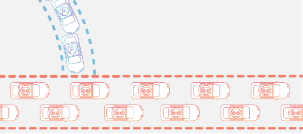
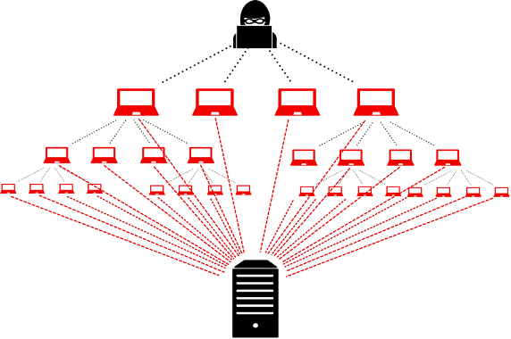
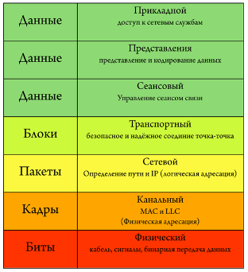
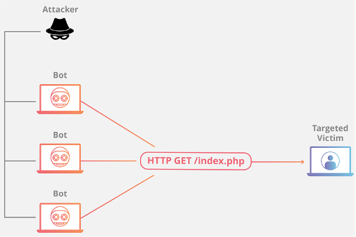
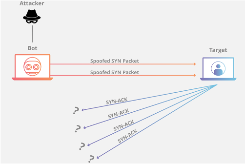
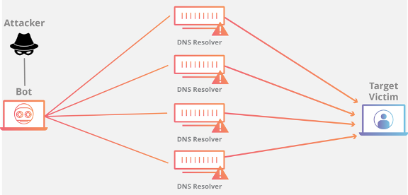
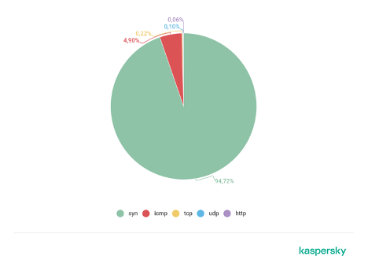

# DoS и DDoS атаки
## 1.	Введение в атаки типа “отказ в обслуживании”
В современном мире компьютерные системы являются многопользовательскими. В настоящее время любой обмен информацией связан с использованием компьютерных сетей. Они используются во всех сферах жизни и науки. Самая большая компьютерная сеть в мире – это сеть Internet. 
В связи с возросшим значением сетей в жизни человечества встает вопрос о безопасных хранении и передачи информации. Нормальное функционирование компьютерных систем во многом зависит от защищенности каналов передачи информации и мест хранения и обработки информации – серверов. От этого зависит скорость и качество работы сетей.
С ростом числа компьютерных систем и с повсеместным внедрением сетей увеличилось число недоброжелателей, желающих получить доступ к информации и нарушить конфиденциальность людей. Преступники различными методами желают получить контроль над информационными системами. Одним из таких преступных способов в сети Internet является сетевая кибератака.
## 2.	DoS и DDoS атаки
DoS attack - аббревиатура от английского “Denial of Service” – Отказ в обслуживании -кибератака, направленная на выведения вычислительной системы из строя, т. е. доведения ее до отказа. Преступник стремится сделать компьютер или сервер (сетевой ресурс) недоступным для пользователей на временный или неопределенный срок путем нарушения работы хоста, подключенного к сети (например, Интернет). DoS-атаки проводятся путем генерации большого числа пакетов или запросов, которые отправляются на целевую вычислительную машину. Система или сервер, а также окружающая их инфраструктура не способны обработать такое мощный поток трафика и перегружаются. В конечном счете сервер перестает обрабатывать адекватные запросы, что приводит к различным тяжелым последствиям. С высокого уровня DoS-атака похожа на неожиданную пробку, забивающую шоссе, не позволяя регулярному трафику прибыть к месту назначения (рис. 1).

 

В случае, когда кибератака производится злоумышленником с нескольких скомпрометированных компьютерных систем, то такая атака называется распределенной. На английском языке: Distributed Denial of Service-attack. DDoS- атаки эффективны за счет использования множества систем, так как каждая система имеет свой уникальный IP адрес, что затрудняет нахождение преступника, а также атака с нескольких устройств способна вызвать отказ даже в хорошо защищенных системах. На сегодняшний день DoS и DDoS атаки являются очень популярными хакерскими средствами, потому что позволяют “сломать” практически любую систему, не оставляя значимых улик. Таким атакам подвержены как компьютеры пользователей, так и сервера правительств и глобальных корпораций. Атаки отказа в обслуживании наносят непоправимый финансовый и репутационный ущерб. К тому же на сегодняшний день не существует универсального метода борьбы с такими сетевыми кибератаками.  
## 3.	Принцип работы DDoS -атак
В DDoS-атаках роль атакующего выполняют сети компьютеров, подключенных к интернету. Эти сети состоят из обычных компьютеров и других устройств (например, устройства IoT), которые были заражены вредоносными программами, что позволяет злоумышленнику удаленно управлять ими. Эти отдельные устройства называются ботами (или зомби), а группа ботов называется бот-сетью (ботнетом). В атаках может принимать от нескольких сотен до нескольких тысяч хостов. После разворачивания зомби-сети, злоумышленник может начать атаку, всего лишь послав инструкции ботам. Когда сервер или сеть жертвы становятся мишенью ботнета, каждый бот отправляет запросы на IP-адрес цели, что потенциально приводит к перегрузке сервера или сети, что приводит к отказу в обслуживании нормального трафика. Таким образом, программы, работая в фоновом режиме, непрерывно посылают запросы на атакуемый сервер, выводя его из строя. Поскольку каждый бот является законным интернет-устройством, отделение атакующего трафика от обычного трафика может быть затруднено (рис. 2).

 

Ниже описаны две наиболее типичные разновидности атак DDoS:
-	Атаки с заполнением полосы пропускания – эти атаки DDoS истощают ресурсы сетевой полосы пропускания или сетевого оборудования, заполняя полосу и оборудование большим количеством “мусорных” пакетов. Выбранные в качестве жертвы системы, каждая из которых имеет лишь ограниченные ресурсы обработки, под действием атаки могут стать недоступны для обработки корректных транзакций или выйти из строя под большой нагрузкой. Самая распространенная форма атаки с заполнением полосы пропускания – это массированная атака с отправкой пакетов, при которой большое количество внешне благонадежных пакетов протокола TCP и других протоколов направляется в конкретную точку. Для того чтобы еще больше затруднить выявление такой атаки, используются недействительные IP-адреса, с которых, предположительно, поступил запрос, чтобы сделать идентификацию невозможной.
-	Атаки на приложения – В этих атаках DDoS хакеры эксплуатируют ожидаемое поведение протоколов, в частности, TCP и HTTP. Они захватывают вычислительные ресурсы, не давая им возможности обрабатывать транзакции и запросы. Пример атак на приложения: это атаки с полуоткрытыми соединениями HTTP и с ошибочными соединениями HTTP.
## 4.	Классификация сетевых атак
Различные типы DDoS - атак нацелены на различные компоненты сетевого соединения. Чтобы понять, как работают различные DDoS-атаки, необходимо знать, как осуществляется сетевое соединение.
Сетевое соединение в интернете состоит из множества различных компонентов или “слоев. Каждый слой в модели имеет свое назначение.
Модель OSI, показанная ниже, представляет собой концептуальную основу, используемую для описания сетевых подключений в 7 различных слоях.
 
 

Хотя почти все DDoS-атаки включают в себя подавление целевого устройства или сети трафиком, атаки можно разделить на три категории. Атакующий может использовать один или несколько различных векторов атаки или циклические векторы атаки в ответ на контрмеры, принимаемые целью.
DDoS-атаки происходят на следующие уровни OSI:
- 2-й уровень - канальный,
- 3-й - сетевой,
- 4-й - транспортный,
- 7-й - прикладной (уровень приложений).
 Мировой лидер в области защиты от DDoS-атак американская компания CloudFlare выделяет следующие типы сетевых атак:

- Атаки на прикладной уровень

Цель атаки: иногда называемая DDoS-атакой уровня 7 (в отношении 7-го уровня модели OSI), цель этих атак состоит в том, чтобы исчерпать ресурсы цели для создания отказа в обслуживании.
Атаки нацелены на уровень, где веб-страницы генерируются на сервере и доставляются в ответ на HTTP-запросы. Один HTTP-запрос вычислительно дешев для выполнения на стороне клиента, но он может быть дорогим для целевого сервера, поскольку сервер часто загружает несколько файлов и выполняет запросы базы данных для создания веб-страницы.
От атак 7-го уровня трудно защититься, так как может быть трудно отличить вредоносный трафик от законного трафика.
Пример атаки на прикладном уровне приведен на рис. 4.
 
  

Типичным примером такой атаки является HTTP-flood. Эта атака похожа на нажатие кнопки Обновить в веб – браузере снова и снова на многих компьютерах одновременно-большое количество HTTP-запросов наводняет сервер, что приводит к отказу в обслуживании. Этот тип атаки варьируется от простого до сложного. Более простые реализации могут получить доступ к одному URL-адресу с тем же диапазоном атакующих IP-адресов. Сложные версии могут использовать большое количество атакующих IP-адресов и нацеливаться на случайные URL-адреса с помощью случайных рефереров и агентов пользователей.

- Протокольные атаки

Цель атаки: Протокольные атаки, также известные как атаки с исчерпанием состояния, вызывают нарушение работы службы из-за чрезмерного потребления ресурсов сервера и/или ресурсов сетевого оборудования, таких как брандмауэры и балансировщики нагрузки. Протокольные атаки используют слабые места в уровне 3 и уровне 4 стека протоколов, чтобы сделать цель недоступной.
Пример атаки по протоколу:
 
   

SYN-flood — такая атака. В этом случае атакующие злоупотребляют TCP-соединением, нарушая типовой трёхсторонний обмен данными. В начале TCP-соединения клиент отправляет серверу команду SYN (синхронизация), на что сервер отвечает SYN-ACK (синхронизация, принято), затем клиент отвечает своим ACK (принято) и соединение устанавливается. При SYN-флуде атакующий (вредоносный клиент) либо не посылает ожидаемого ACK и продолжает слать SYN, увеличивая количество «полуоткрытых» соединений, либо отправляет серверу фальсифицированный IP, куда и уходят SYN-ACK. При этом, поскольку с того IP команды SYN не отправлялось, то и ACK не поступит. Целевая машина отвечает на каждый запрос соединения, а затем ожидает последнего шага в синхронизации, который никогда не происходит. При этом исчерпываются ресурсы цели.

- Массированные атаки

Цель атаки: Эта категория атак пытается создать перегрузку, потребляя всю доступную полосу пропускания между целью и более крупным Интернетом. Большие объемы данных передаются целевому объекту с помощью формы усиления или других средств создания массивного трафика, таких как запросы из ботнета. Пример усиления:
   
   

Пример DDoS-атаки типа "усиление"(amplification) с использованием сервиса DNS (DNS amplification). 
Суть атаки заключается в том, чтобы в ответ на DNS-запрос приходил ответ, в несколько раз больший, чем запрос. Поскольку протокол DNS основан на UDP, в запросе подменяется адрес отправителя на адрес жертвы, и генерируется трафик к большому количеству IP-адресов, на которых обнаружена возможность рекурсии.
Чаще всего преступники используют комбинации атак, что осложняет защиту целевых систем. 
Российский лидер в области кибербезопасности - компания “KasperskyLab” регулярно выпускает отчеты о DDoS – атаках. На момент написания работы актуальным был отчет за II-й квартал 2020 года. Этот период времени характеризуется усилением пандемии коронавирусной инфекции и введением карантинных мер во всем в мире. Вынужденное перемещение жизни человечества в Internet отрицательно сказалось на числе атак типа “отказ в обслуживании”. На рисунке ниже представлена диаграмма типов атак, взятая с открытого источника [KasperskyLAB](https://securelist.ru/ddos-attacks-in-q2-2020/97701/).
     
   

Из диаграммы видно, что наиболее распространённым типом атак были атаки по протоколу TCP (SYN-flood). 
