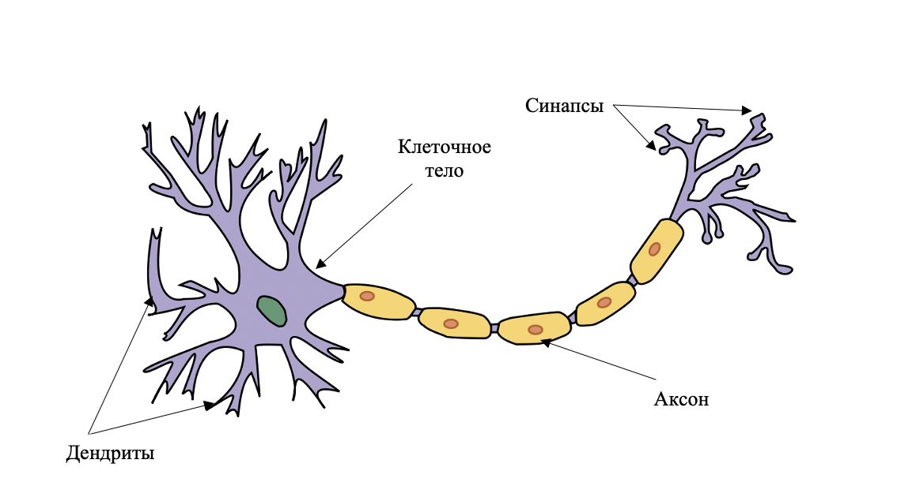
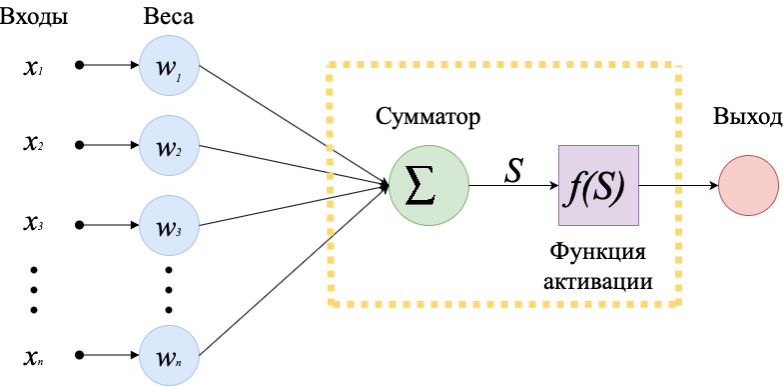
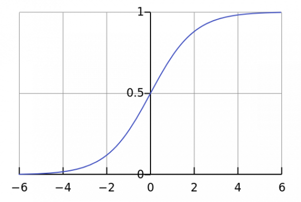
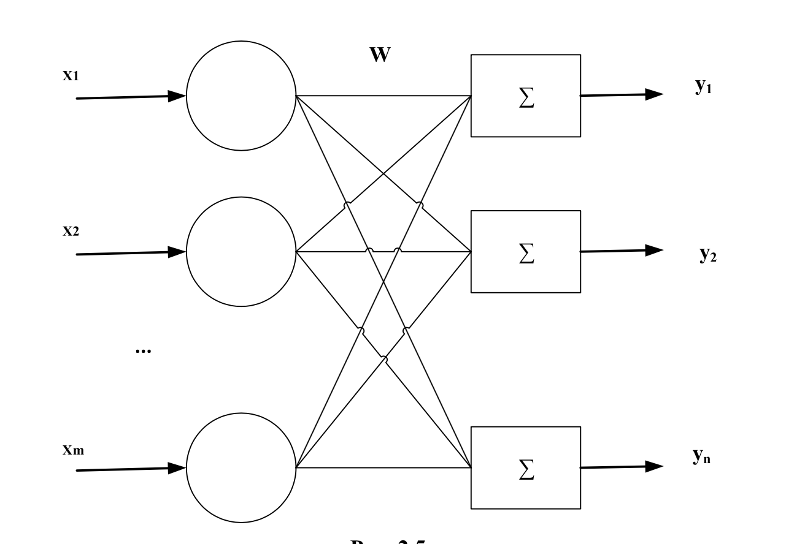
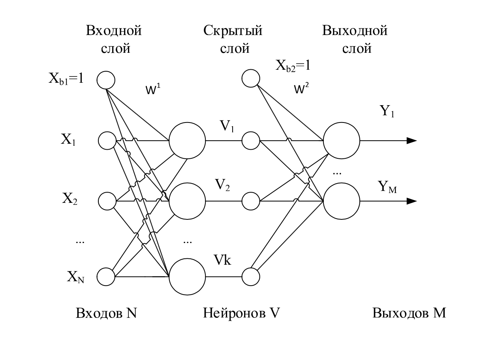
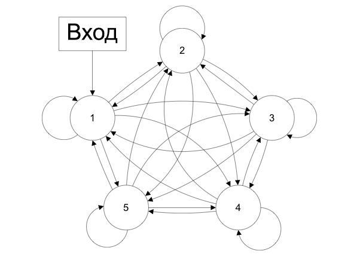
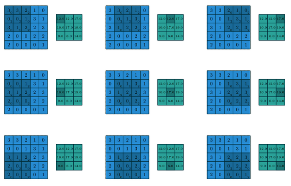
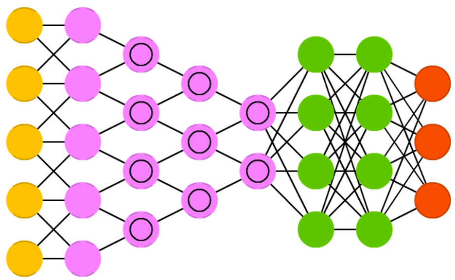
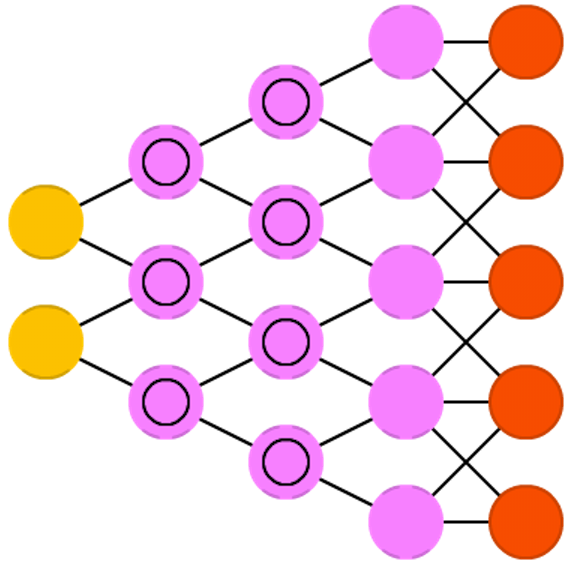

# Искусственные нейронные сети (ИНС)

## 1. Введение в неронные сети
Научные исследования в области искусственного интеллекта (ИИ) начались в первой половине XX века. Одним из важных составляющих ИИ являются нейронные сети.
Впервые термин «нейронная сеть» был определен в 1943 г. американскими учеными У. Маккалоком и У. Питсом в процессе исследований в области искусственного интеллекта при попытках воспроизвести способность биологических нервных систем обучаться, прогнозировать и распознавать поступающую информацию. Эту задачу они пытались решить, моделируя низкоуровневую структуру мозга живых существ. Их идея заключалась в том, что сложную структуру связей между нейронными клетками можно формализовать в простую связь типа «вход-выход» с помощью искусственных нейросетей.
Следующий важный этап в развитии новой отрасли науки был преодолен в 1958 году, когда нейрофизиолог Ф. Розенблатт предложил одну из первых реализаций НС -перцептрон. Она успешно применялась для решения задач прогнозирования и классификации. Однако в 1969 году М. Ли Минский опубликовал книгу, в которой доказал ограниченные возможности перцептронов. 
Затем только в 1982 году Дж. Хопфилдом была представлена модель сети, носящая теперь его имя. В том же году Т. Кохонен реализовал нейронные сети, способные обучаться без учителя – сеть Кохонена и самоорганизующаяся карта Кохонена.
В 1986 году информатики Д. Румельхарт, Д. Хинтон и Р. Вильямс развили один из наиболее популярных методов обучения нейросетей - метод обратной ошибки.  
С конца 1980-х годов в связи с разработкой высокопроизводительных компьютеров началась активная работа в этой области информатики и искусственного интеллекта. Появлялись новые типы сетей, а также совершенствовались и реализовывались новые методы обучения нейронных сетей.
В современное время нейронные сети применяются в решении разных классов задач. ИНС можно встретить в разных науках: от экономики до медицины. Большое распространение нейросети получили в области информационной безопасности и в сфере защиты информации и личных данных.
## 2. Определение нейронной сети
Нейронная сеть - это математическая модель, а также ее программная реализация, основанная на принципах работы биологических нервных систем живых организмов - нейронов головного мозга. В нервной системе живых организмов элементарной структурной единицей является нервная клетка (нейрон). 
Нервная клетка - это клетка, возбуждаемая (т. е. активизирующаяся) электрическими импульсами, которая предназначена для приема из внешней среды, обработки, хранения, передачи и вывода информации при помощи химических реакций и электрических сигналов. У разных организмов число этих клеток, а следовательно, и способности мозга различаются. В человеческом мозге при рождении число нейронов достигает порядка 1011.  Основными элементами клетки являются ее тело и отростки нервных волокон: единственный аксон и множество дендритов. Дендриты - это нервные окончания, способные принимать информацию извне в виде импульсов, а аксон передает сигналы от нейронов далее другим клеткам или во внешнюю среду. На окончаниях этих волокон находятся синапсы(терминалы), которые объединяют аксоны одних клеток с дендритами других и регулируют мощность сигналов, протекающих по нервным тканям. На рис. 1 представлено изображение естественного нейрона с основными элементами.

Аналогом биологической нервной клетки в ИНС являются искусственные нейроны (далее нейрон). Нейрон является элементарной единицей обработки информации в сети и представляет собой сильно упрощенную модель нервной клетки. В модели нейрона можно выявить три основных элемента:
	
1. Набор связей (синапсов), по которым поступают сигналы от других нейронов или входная информация. Каждый синапс (i - связь) характеризуется своим весом (силой) 
	. При поступлении сигнала (параметра)  он умножается на соответствующий этому синапсу вес (т.е. ). 
	
2. Сумматор линейно складывает все поступившие и взвешенные относительно синапсов этого нейрона импульсы. Он определяет входное состояние S нейрона и записывается в виде формулы:
	
	
	
3. Функция активации (передаточная функция)  определяет зависимость сигнала на выходе нейрона (аналог аксона) от взвешенной суммы сигналов от входов. Она ограничивает амплитуду выходного сигнала в диапазоне от [0,1] или от [-1,1]. Такой диапазон называется нормализованным.

Существуют различные математические функции, которые могут использоваться в качестве функции активации f: ступенчатая функция Хэвисайда, функция гиперболического тангенса, кусочно-линейная функция, сигмоидальная функция и т.д.
Одной из наиболее часто используемых функций является нелинейная функция с насыщением - сигмоидальная (логистическая) функция:
 
 

 ,где α -  параметр наклона функции. Эта быстро возрастающая функция поддерживает баланс между линейным и нелинейным поведением. Кроме того, сигмоида дифференцируема на всей области определения, что играет важную роль в некоторых методах обучения нейронных сетей. Более того ее производная может быть выражена через саму функцию. Особенностью нейронов с такой передаточной характеристикой является то, что они усиливают сильные сигналы существенно меньше, чем слабые, поскольку области сильных сигналов соответствуют пологим участкам характеристики. Это позволяет предотвратить насыщение от больших сигналов. В этой работе сигмоидальная функция будет использоваться в качестве передаточной функции.  График этой функции изображен на рис. 3.

## 4. Архитектура нейронных сетей
Хотя даже один нейрон может выполнять простейшие операции распознавания, возможности нейронных сетей основаны на их соединениях с другими нейронами. Можно выделить несколько основных типов нейронных сетей. Классификация сетей ведется по разным признакам: число слоев, способы взаимодействия с другими нейронами, методы обучения.
Однослойные сети. Простейшей нейросетью является персептрон. Он называется однослойной сетью, так как под слоями подразумеваются не слои узлов, а слои вычислительных элементов. Однослойная нейронная сеть – сеть, в которой сигналы от входного слоя сразу подаются на выходной слой, преобразующий сигнал и сразу выдающий ответ (рис. 4). 
 

Многослойные нейронные сети. Сети, состоящие из нескольких слоев нейронов. Слой – это совокупность нейронов, на которые подается один и тот же сигнал. Многослойные сети характеризуются одним или несколькими скрытыми слоями помимо входного и выходного слоев (рис. 5). Функция скрытых нейронов – это посредничество между внешними входными импульсами и выходом сети. 
  

Приведенные нейронные сети являются самыми простыми и называются сетями прямого распространения (feedforward neural network FFN). В таких сетях информация передается от слоя к слою последовательно.  При этом нейроны одного слоя не связаны между собой, а соседние слои полностью связаны. Более сложные архитектуры нейронных сетей основаны на сетях прямого распространения.
Полносвязные нейронные сети. Это такие сети, в которых входные данные отправляются сразу всем элементам сети. Каждый нейрон получает информацию от других и, обработав ее, посылает свой результат остальным нейронам сразу.  Выходная информация получается после нескольких итераций работы. Выходными могут быть все или несколько нейронов. 
Существуют сети, в которых выходная информация может снова подаваться на его вход. Эти нейросети называются цепями с обратными связями или реккурентными (recurrent neural network, RNN).  Такие сети являются одними из самых сложных в реализации. Однако у них есть неоспоримое преимуществ: наличие обратных связей позволяет запоминать и воспроизводить целые последовательности реакций на сигнал. Иначе говоря, эти сети обладают элементарной памятью. Нейронные сети с обратной связью приведены на рис. 6.

Также нейронные сети могут быть классифицированы по типу решаемых задач. Примерами таких сетей являются сверточные нейронные сети (convolutional neural network, CNN). Их основное предназначение – распознавание графических образов (реже аудио). Их принцип работы заключается в следующем: когда на вход поступает изображение размером , то оно разбивается на фрагменты. Затем каждый фрагмент умножается на матрицу («ядро») свертки, а полученный результат суммируется и записывается в соответствующую позицию выходного изображения (рис. 7). 
 
 

Такой подход существенно упрощает обработку данных. Более того, эти сети еще называют глубинными, так как они могут сжиматься с глубиной по закону степени двойки (2^n). Таким образом, такая сеть способна определить, что изображено на картинке. Ниже приведена схема сети.

 

Обратным к сверточным сетям являются разверточные нейросети (deconvolutional neural network, DNN. Их задача обратна к задачам сверточных сетей. Их работа заключается в генерации изображения по определенным входным данным (рис. 9).
 
 

Приведенные примеры нейронных сетей не являются исчерпывающим списком существующих сетей. В мире есть множество архитектур сетей. Кроме этого, разрабатываются новые типы сетей и совершенствуются существующие нейросети
