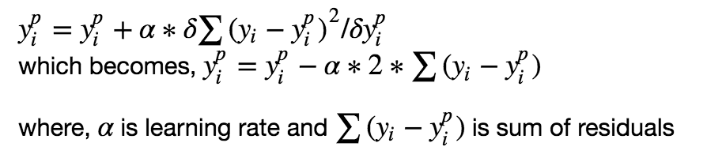

# Градиентный бустинг
## Введение
**Бустинг** (англ. boosting — усиление) — композиционный метаалгоритм машинного обучения, применяется, главным образом, для уменьшения смещения, а также дисперсии
 в обучении с учителем. Также определяется как семейство алгоритмов машинного обучения,
  преобразующих слабые обучающие алгоритмы к сильным.

Бустинг основан на вопросе, поднятом Кернсом и Вэлиантом (1988, 1989): «Может ли набор слабых обучающих алгоритмов создать сильный обучающий алгоритм?». Слабый обучающий алгоритм определяется как классификатор, который слабо коррелирует с правильной классификацией (может пометить примеры лучше, чем случайное угадывание). В отличие от слабого алгоритма, сильный обучающий алгоритм является классификатором, хорошо коррелирующим с верной классификацией.

Положительный ответ Роберта Шапирe в статье 1990 года на вопрос Кернса и Вэлианта имел большое значение для теории машинного обучения и статистики, и привёл к созданию широкого спектра алгоритмов бустинга.

**Гипотеза о бустинге** относилась к процессу настройки алгоритма слабого обучения для получения строгого обучения. Неформально, спрашивается, вытекает ли из существования эффективного алгоритма обучения, выходом которого служит гипотеза, эффективность которой лишь слегка лучше случайного гадания (то есть слабое обучение), существование эффективного алгоритма, который даёт гипотезу произвольной точности (то есть сильное обучение). Алгоритмы, которые получают быстро такую гипотезу, становятся известны просто как «бустинг». Алгоритм «arcing» Фройнда и Шапире (Adaptive Resampling and Combining), как общая техника, является более-менее синонимом бустингу

##Ансамбли, бэггинг и бустинг

Когда мы пытаемся предсказать целевую переменную с помощью любого алгоритма машинного обучения, главные причины отличий реальной и предсказанной переменной — это noise, variance и bias. Ансамбль помогает уменьшить эти факторы (за исключением noise — это неуменьшаемая величина).

**Ансамбль** — это набор предсказателей, которые вместе дают ответ (например, среднее по всем). Причина почему мы используем ансамбли — несколько предсказателей, которые пытаюсь получить одну и ту же переменную дадут более точный результат, нежели одиночный предсказатель. Техники ансамблирования впоследствии классифицируются в Бэггинг и Бустинг.

**Бэггинг** — простая техника, в которой мы строим независимые модели и комбинируем их, используя некоторую модель усреднения (например, взвешенное среднее, голосование большинства или нормальное среднее).

Обычно берут случайную подвыборку данных для каждой модели, так все модели немного отличаются друг от друга. Выборка строится по модели выбора с возвращением. Из-за того что данная техника использует множество некореллириющих моделей для построения итоговой модели, это уменьшает variance. Примером бэггинга служит модель случайного леса (Random Forest, RF)

**Бустинг** — это техника построения ансамблей, в которой предсказатели построены не независимо, а последовательно

Это техника использует идею о том, что следующая модель будет учится на ошибках предыдущей. Они имеют неравную вероятность появления в последующих моделях, и чаще появятся те, что дают наибольшую ошибку. Предсказатели могут быть выбраны из широкого ассортимента моделей, например, деревья решений, регрессия, классификаторы и т.д. Из-за того, что предсказатели обучаются на ошибках, совершенных предыдущими, требуется меньше времени для того, чтобы добраться до реального ответа. Но мы должны выбирать критерий остановки с осторожностью, иначе это может привести к переобучению. Градиентный бустинг — это пример бустинга.

##Алгоритм градиентного бустинга

**Градиентный бустинг** — это техника машинного обучения для задач классификации и регрессии, которая строит модель предсказания в форме ансамбля слабых предсказывающих моделей, обычно деревьев решений.

Цель любого алгоритма обучения с учителем — определить функцию потерь и минимизировать её. Давайте обратимся к математике градиентного бустинга. Пусть, например, в качестве функции потерь будет среднеквадратичная ошибка (MSE):

Мы хотим, чтобы построить наши предсказания таким образом, чтобы MSE была минимальна. Используя градиентный спуск и обновляя предсказания, основанные на скорости обучения (learning rate), ищем значения, на которых MSE минимальна.

Итак, мы просто обновляем предсказания таким образом, что сумма наших отклонений стремилась к нулю и предсказанные значения были близки к реальным.

### Интуиция за градиентным бустингом

Логика, что стоит за градиентым бустингом, проста, ее можно понять интуитивно, без математического формализма. Предполагается, что читатель знаком с простой линейной регрессией.

Первое предположение линейной регресии, что сумма отклонений = 0, т.е. отклонения должны быть случайно распределены в окрестности нуля.

Нормальное распределение выборки отклонений со средним 0
Нормальное распределение выборки отклонений со средним 0
Теперь давайте думать о отклонениях, как об ошибках, сделанных нашей моделью. Хотя в моделях основанных на деревьях не делается такого предположения, если мы будем размышлять об этом предположении логически (не статистически), мы можем понять, что увидив принцип распределения отклонений, сможем использовать данный паттерн для модели.

Итак, интуиция за алгоритмом градиентного бустинга — *итеративно применять паттерны отклонений и улучшать предсказания*. Как только мы достигли момента, когда отклонения не имеют никакого паттерна, мы прекращаем достраивать нашу модель (иначе это может привести к переобучению). Алгоритмически, мы минимизируем нашу функцию потерь.

В итоге,
* Сначала строим простые модели и анализируем ошибки;
* Определяем точки, которые не вписываются в простую модель;
* Добавляем модели, которые обрабатывают сложные случаи, которые были выявлены на начальной модели;
* Собираем все построенные модели, определяя вес каждого предсказателя.
